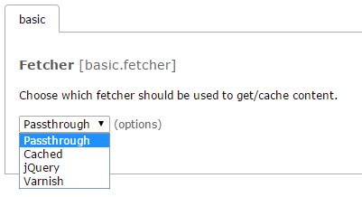
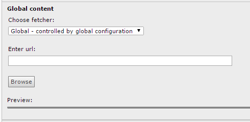

.. ==================================================
.. FOR YOUR INFORMATION
.. --------------------------------------------------
.. -*- coding: utf-8 -*- with BOM.

.. include:: Includes.txt

.. _start:

================
Global Content
================

.. only:: html

   :Classification:
      globalcontent

   :Version:
      |release|

   :Language:
      en

   :Keywords:
      global,content,share

   :Copyright:
      2011-2014

   :Author:
      Carsten Jørgensen

   :Email:
      carsten@linkfactory.dk

   :License:
      This document is published under the Open Content License
      available from http://www.opencontent.org/opl.shtml

   :Rendered:
      |today|

   The content of this document is related to TYPO3,
   a GNU/GPL CMS/Framework available from `www.typo3.org <http://www.typo3.org/>`_.

   
What does it do
---------------
Extension globalcontent implements a way of sharing content between installations. The system has a backend where you, as editor, can create an element where content is fetch'ed from an element on a foreign installation. In the frontend, the element will be shown as a normal element. When selecting element, globalcontent will call the specified url on remote installation and get the page, but with a specific page-type to frame all elements and add a button to choose element. When page with element is shown, it will fetch the remote element based on fetcher.

Requirements
------------
* globalcontent must be installed on both installations (local and remote).
* "Global Content Page Types" must be included in template on remote installation.

Configuration
-------------
On the server side it is necessary to choose fetcher.

Following fetcher's are available:

* Passthrough - no caching
* Cached - use caching framework
* jQuery - loading with sliding and fading
* Varnish - cache controlled by Varnish

Create/update element
---------------------
When you create/update an globalcontent-element, you will see following....

To get element from another installation, you have to do following.

* Choose fetcher. Following fetcher's are available:

  * Global - controlled by global configuration
  * Passthrough - no caching
  * Cached - use caching framework
  * jQuery - loading with sliding and fading
  * Varnish - cache controlled by Varnish

* Insert the url, where you want to fetch content-element from.
* Click [Browse]. A new window will open so you can choose the element you want to show on page.
* When element is chosen, page will close again and now you can see your element preview'ed at the bottom.

Fetcher
-------
* Passthrough - There is no caching involved. It is recommended to only choose this if you are sure that a caching solution exists on remote installation. Otherwise this option will cause this page to be slow.

* Cached - This option uses TYPO3's internal caching framework.

* jQuery - If remote is slow, your will see a spinner but most important, it will not slow down load of page.

* Varnish - This option assume that you have Varnish in your installation.

Pitfalls
--------
If you wish to use one of the methods merging the content before it is sent to the browser (thats is: passthrough, caching or varnish),
you should make sure that the URL's to images and other ressources are absolute.
It this is not the case the ressources will be interpreted to relative to the site hosting the globalcontent element and not the site where the images is really available.
You can setup absolute URL's this way: (given the proper URL us in constant plugin.site_config.baseUrl)

.. code-block:: typoscript

   globalContentSingle.config.absRefPrefix = {$plugin.site_config.baseUrl}
